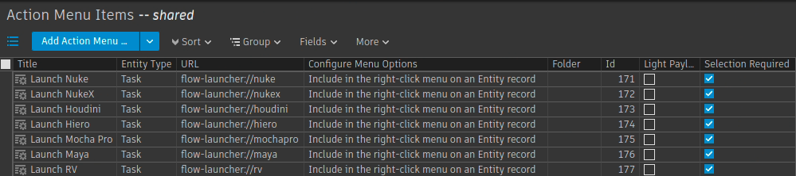

# FlowLauncher

## Overview

The `FlowLauncher` is a custom tool designed to launch AYON applications based on a specific protocol URL scheme. This tool is particularly useful for integrating with Flow and automating workflows by launching the appropriate AYON applications directly from custom action menu items within Flow.

When installed, the FlowLauncher is registered as a URL protocol handler, meaning it listens for URLs starting with `flow-launcher://` and triggers the appropriate application when these URLs are accessed. The launched application is executed through a new terminal, where the output is visible to the user while also being logged for further review.

## Terminal Output and Logging

One of the key features of FlowLauncher is that it launches the AYON application in a new terminal, so the user can see live output in real-time. In addition to showing the output in the terminal, the command output is redirected to a specific directory (`/ax_logs/`) on the user's machine. This allows for easy review and debugging by both the user and other team members who may need to check logs after the process completes.

- **Terminal Output**: The user can monitor the command's progress directly in the terminal window that opens when FlowLauncher is triggered. This is helpful for real-time feedback.
- **Log Storage**: All terminal output, including errors, is simultaneously saved to the `/ax_logs/$(hostname)/ayon/` directory. The logs are stored in a file named after the timestamp of when the command was executed. This ensures that logs are available for future reference and debugging.

This dual approach of providing terminal output and saving logs ensures that nothing is missed during execution and simplifies troubleshooting in collaborative environments.

## Components

### 1. `flow_launcher.py`

This Python script is the core of FlowLauncher’s functionality. It parses a custom protocol URL, extracts necessary parameters (such as project names and task IDs), and launches the corresponding AYON application.

- **Key Features:**
  - Parses URLs in the format of `flow-launcher://action_name?project_name=<project>&ids=<task_id>&other_param=value`.
  - Connects to Flow to retrieve task-specific information.
  - Uses AYON’s API to find and launch the appropriate application version.
  - Supports launching applications with different contexts based on the action specified in the URL.
  - Outputs both to a terminal window and logs the output to `/ax_logs/$(hostname)/ayon/` for review.

- **Execution Flow:**
  1. The script is triggered by a custom protocol URL, passed as an argument.
  2. It checks the validity of the URL and extracts the action, project name, and task IDs.
  3. The script queries Flow for task details.
  4. It then identifies the corresponding AYON application and launches it using the `AddonsManager`.
  5. The process’s output is shown in a new terminal window while also being logged for future reference.

### 2. `flow_launcher.install_handler`

This file automates the registration of the FlowLauncher as the protocol handler for `flow-launcher://` URLs across different desktop environments.

- **Key Features:**
  - Automates the installation and registration process for both GNOME and KDE desktop environments.
  - Registers the flow-launcher protocol, ensuring any URL starting with `flow-launcher://` will be handled by this application.
  - Provides an option for a staging environment to run the script under different conditions.

- **Installation Steps:**
  - GNOME: Registers FlowLauncher as a URL handler using `gconftool-2`.
  - KDE: Creates and installs the necessary protocol file in the appropriate KDE directory.
  - XDG/Chrome: Installs FlowLauncher as a protocol handler using the XDG desktop file, making it available for applications like Chrome.

- **Actions:**
  - **Standard Execution:** Runs the `flow_launcher.py` script when the `flow-launcher` protocol is triggered. The script is executed inside a terminal with both real-time output visible to the user and a log of the output saved to `/ax_logs/`.
  - **Staging Environment:** Provides an alternative action to run the script in a staging environment.

## Installation

### 1. Run the Installation Script

To register FlowLauncher as the protocol handler for your desktop environment, execute the `flow_launcher.install_handler` script. This script automates the entire setup process.

```bash
./flow_launcher.install_handler
```
#### Alkemy-X integration

The file is currently being ran automatically when our machines boot up through the AYON Ansible role at https://gitlab.alkemy-x.com/coreweave/infrastructure/virtual-servers/virtserver-ansible/-/tree/master/roles/ayon?ref_type=heads

### 2. Add the AMI in Flow

In order to expose the launch actions in Flow we go to the Action Menu Items configuration and we add an entry for each DCC we want to launch, like so:

